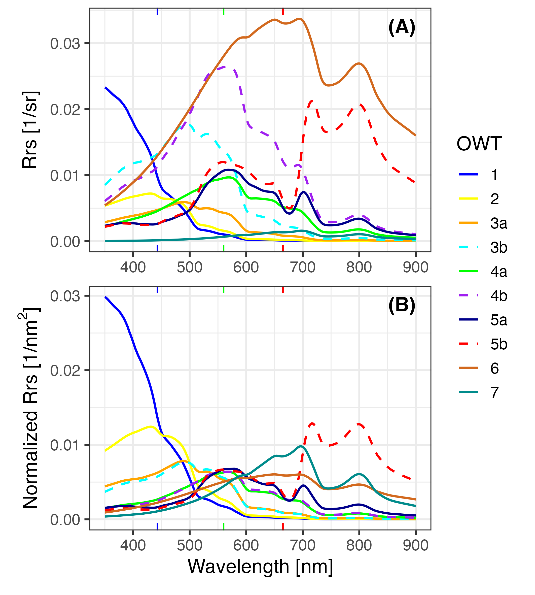

# **pyOWT**: python library for Optical Water Type classification

Version 0.61

by [Shun Bi](Shun.Bi@outlook.com) 

Last update 23.10.2024

Note: this repo is translated from the R repo [`OWT`](https://github.com/bishun945/OWT) for the water type classification and has been maintained independently from its original version.

# Install

Clone the whole repo and cd to the folder. 

Then, install the [requirements](/requirements.txt).

```console
pip install -r requirements.txt
```

You can also install it via 

```console
pip install -e .
```

# License

See the [LICENSE](/LICENSE) file.

# How to use it

Two classes, `OWT` and `OpticalVariables` are needed to perform the OWT classification.

```python
from pyowt.OWT import OWT
from pyowt.OpticalVariables import OpticalVariables
from pyowt.PlotOWT import PlotOV, PlotSpec

# first calculate three optical variables from Rrs
# `sensor` should be specified for satellite data
ov = OpticalVariables(Rrs=Rrs_data, band=Band_list, sensor=Sensor_str)

# feed data into classification
owt = OWT(AVW=ov.AVW, Area=ov.Area, NDI=ov.NDI)

# show classification results
print(owt.type_str) 

# show plots

## scatter plot
PlotOV(owt) 

## spectral distribution
PlotSpec(owt, ov, norm=False) 

## spectral distribution - normalized
PlotSpec(owt, ov, norm=True)
```

Check the [example](/run_examples.py) file for more detailed demo runs:

1) Some hyperspectral Remote-sensing reflectance data simulated by Bi et al. (2023)

2) Satellite data with atmosphericly corrected by A4O (Hieronymi et al. 2023)

# Short description of OWTs

|OWT | Desciption |
|----|------------|
| 1  | Extremely clear and oligotrophic indigo-blue waters with high reflectance in the short visible wavelengths. |
| 2  | Blue waters with similar biomass level as OWT 1 but with slightly higher detritus and CDOM content. |
| 3a | Turquoise waters with slightly higher phytoplankton, detritus, and CDOM compared to the first two types. |
| 3b | A special case of OWT 3a with similar detritus and CDOM distribution but with strong scattering and little absorbing particles like in the case of Coccolithophore blooms. This type usually appears brighter and exhibits a remarkable ~490 nm reflectance peak. |
| 4a | Greenish water found in coastal and inland environments, with higher biomass compared to the previous water types. Reflectance in short wavelengths is usually depressed by the absorption of particles and CDOM. |
| 4b | A special case of OWT 4a, sharing similar detritus and CDOM distribution, exhibiting phytoplankton blooms with higher scattering coefficients, e.g., Coccolithophore bloom. The color of this type shows a very bright green. |
| 5a | Green eutrophic water, with significantly higher phytoplankton biomass, exhibiting a bimodal reflectance shape with typical peaks at ~560 and ~709 nm.|
| 5b | Green hyper-eutrophic water, with even higher biomass than that of OWT 5a (over several orders of magnitude), displaying a reflectance plateau in the Near Infrared Region, NIR (vegetation-like spectrum). |
| 6  | Bright brown water with high detritus concentrations, which has a high reflectance determined by scattering. |
| 7  | Dark brown to black water with very high CDOM concentration, which has low reflectance in the entire visible range and is dominated by absorption.  |

<br>

<center>



</center>

*Mean spectrum of simulated spectra for optical water types. Panel (A) displays the raw remote-sensing reflectance (unscaled), while Panel (B) shows the spectral normalized by trapezoidal-area. The positions of RGB bands are marked on the x-axis.*

# Bug rerport

When you find any issues or bugs while running the module, please [open an issue](https://github.com/bishun945/pyOWT/issues) or directly contact [Shun Bi](Shun.Bi@outlook.com) with a reproducible script with data.

# Project related content

## AquaINFRA details

This part is supported by [Merret Buurman](merret.buurman@igb-berlin.de)

AquaINFRA related scripts can be found in `projects/AquaINFRA`

When running this as OGC-compliant web service in an installation of pygeoapi, please create a json config file `config.json` with the below contents (or add it to the general AquaINFRA config file), and define an environment variable called `PYOWT_CONFIG_FILE` that contains the path to it.

```
{
    "download_dir": "/var/www/nginx/download/",
    "download_url": "https://someserver/download/",
    "pyowt": {
        "example_input_data_dir": ".../pygeoapi/process/pyOWT/data/", # this is where the process will try to find existing example inputs
        "input_data_dir": "/.../inputs/", # this is where the process will try to store downloaded inputs
        "path_sensor_band_library": ".../pygeoapi/process/pyOWT/data/sensor_band_library.yaml"
    }
}
```


# References

- Bi and Hieronymi (2024). Holistic optical water type classification for ocean, coastal, and inland waters. Limnol Oceanogr. https://doi.org/10.1002/lno.12606

- Bi et al. (2023). Bio-geo-optical modelling of natural waters. Front. Mar. Sci. 10, 1196352. https://doi.org/10.3389/fmars.2023.1196352

- Hieronymi et al. (2023). Ocean color atmospheric correction methods in view of usability for different optical water types. Front. Mar. Sci. 10, 1129876. https://doi.org/10.3389/fmars.2023.1129876 
